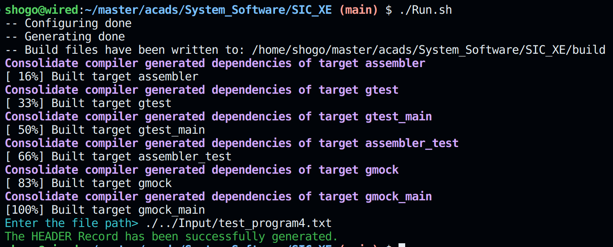

# SIC-XE Assembler

### C++ implementation of an SIC-XE Assembler.

#### The implementation currently supports: 

- [x] Format 1 instructions

- [x] Format 2 instructions

- [x] Format 3 instructions

- [x] Format 4 instructions

- [x] Base Directive

- [x] Comments and *Whitespaces

- [x] Program Relocation

- [x] Literals

- [x] LTORG directive

- [x] EQU directive

- [x] ORG directive

- [x] Expressions

- [x] Program Blocks

## HOW TO RUN

To run the assembler, simply run ``` ./Run.sh ``` from your terminal after cloning the repository. The assembler will ask for the path to your file. If the program is not erroneous, it will generate the corresponding ``` HEADER RECORD ``` in the Output directory. 

Here is an example of execution of a correct program : 




The implementation has a testing framwork and build workflow integrated into it. In case something needs to be modified, we can ensure it does not break other functions by running the tests. So if you find something that should be changed according to you, or perhaps you see an optimisation, do the required changes and add a test for it in the ``` tests ``` directory. I am currently using ``` gtest ``` for the testing. It involves comparing the headers as expected and generated by the assembler. Something like : 

```cpp
TEST({TEST_NAME}, CompareFiles) {
    string filePath1 = "{GENERATED HEADER FILE PATH}";
    string filePath2 = "{EXPECTED HEADER FILE PATH}";
    ASSERT_TRUE(compareFiles(filePath1, filePath2));
}
```

To ensure that your changes pass the CI/CD pipeline for Formatting, run ``` ./format.sh ``` which will run ``` cmake-format -i ``` over the files mentioned in the script. In case you add another file, include the file in the script. 

In case you get the following error : 

```rs
Invalid opcode: {Your_Opcode}
```

It simply means that the Opcode is not included in the opcode.info file. To add it, simply follow the below format : 

```rs
MNEMONIC |  FORMAT   | OPCODE 
{Name}   | {1,2,3/4} | {Code}
```

To ensure the correct execution of the assembler, Please write statements like 

```rs
ADDR    X , A
ADD     TABLE2, X
EQU     BUFEND - BUFFER
```

as 

```rs
ADDR    X,A
ADD     TABLE2,X
EQU     BUFEND-BUFFER
```

Notice the spacing between the statements after the Opcode MNEMONIC. 

## DESIGN

To Explain the design of the assembler, I will take the following code as reference : 

```rs
COPY    START   0
FIRST   STL     RETADR
CLOOP   JSUB    RDREC
        LDA     LENGTH
        COMP    #0
        JEQ     ENDFIL
        JSUB    WRREC
        J       CLOOP
ENDFIL  LDA     =C'EOF'
        STA     BUFFER
        LDA     #3
        STA     LENGTH
        JSUB    WRREC
        J       @RETADR
        USE     CDATA
RETADR  RESW    1
LENGTH  RESW    1
        USE     CBLKS
BUFFER  RESB    4096
BUFEND  EQU     *
MAXLEN  EQU     BUFEND-BUFFER
        USE
RDREC   CLEAR   X
        CLEAR   A
        CLEAR   S
        +LDT    #MAXLEN
RLOOP   TD      INPUT
        JEQ     RLOOP
        RD      INPUT
        COMPR   A,S
        JEQ     EXIT
        STCH    BUFFER,X
        TIXR    T
        JLT     RLOOP
EXIT    STX     LENGTH
        RSUB
        USE     CDATA
INPUT   BYTE    X'F1'
        USE
WRREC   CLEAR   X
        LDT     LENGTH
WLOOP   TD      =X'05'
        JEQ     WLOOP
        LDCH    BUFFER,X
        WD      =X'05'
        TIXR    T
        JLT     WLOOP
        RSUB
        USE     CDATA
        LTORG
        END     FIRST
```

The design follows ``` 2 pass assembler format ``` and strictly follows the specifications specified in the Systems Software book by L.L. Beck. The following variables are used accross the 2 passes of the assembler : 

```cpp
map<string, Opcode> OPTAB;
vector<Instruction> INSTRUCTIONS;
map<string, int> SYMBOL_TABLE; // Name of the symbol -> Address
map<string, int> SYMBOL_BLOCK; // Name of the symbol -> Block Number
map<string, bool>
    SYMBOL_FLAG; // Name of the symbol -> Need to be modified or not
vector<pair<string, int>> LIT_INTERMEDIATE; // {Literal, Length}
map<string, int> LITTAB;                    // Literal -> Address
map<string, int> LIT_BLOCK;                 // Literal -> Block Number
map<string, pair<int, int>> BLOCK_TABLE; // {Block Name, {Block Number, Length}}
map<int, string> BLOCK_NAMES;            // {Block Number, Block Name}
map<int, int> BLOCK_LOCCTR;              // {Block Number, LOCCTR}

vector<VariantType> OBJCODE; // UTILITY TO STORE THE OBJECT CODE

vector<pair<string, int>> RECORDS; // UTILITY TO STORE THE RECORDS

vector<string> MRECORDS; // UTILITY TO STORE THE MODIFICATION RECORDS

// BLOCK RELATED VARS
int BLOCK_NUMBER = 0;
int TOTAL_BLOCKS = 0;
string CURR_BLOCK_NAME = "DEFAULT";

// PROGRAM RELATED GLOBAL VARS
string NAME;
int START_ADDRESS;
int LOCCTR;
int PROGRAM_LENGTH;
bool NOBASE = false;
bool ORG = false;
int prevLOCCTR;
string BASE;
```

Multiple things happen in the ``` pass1 ``` of the assembler:

- The assembler first checks for a ``` USE ``` directive in the code. If it is so, it adds a reference for the same in ``` BLOCK_TABLE ``` and takes account of the length of each block. 
- It then scans for an LTORG statement, if there is one, it creates a corresponding literal pool at that location. 
- Then it checks for the ``` RSUB ``` instruction. I have added a separate check for this instruction alone. 
- Then there is a check for ``` SYMBOLS ``` in the program. If it is already present in the SYMBOL TABLE, we move on, else we add it. 
- After that, there is a check for ``` expressions ```. The logic for expressions was quite complex to figure out since it involved identifying legal expressions and whether a modification record was required for the same or not. I have achieved this by identifying whether or not the generated expression is relative or absolute. Further there is a check for * in which case I simply assign it the current location counter. 
- Then there is a check for ``` ORG ``` statement. It mainly involves manipulation with the Location Counter. 
- Afte that it checks for the ``` BASE ``` directive and presence of WORD directives like ``` WORD , RESW, RESB, BASE ```. It involved a lot of repetetive code and so I create a multi line define statement for it : 

```cpp
#define data_directive()                                                       \
    {                                                                          \
        instruction.address = LOCCTR;                                          \
        instruction.data = tokens[2];                                          \
        instruction.format = Format::DATA;                                     \
        instruction.opcode.code = 0;                                           \
        instruction.opcode.format = Format::DATA;                              \
        instruction.new_block = false;                                         \
    }

```

- Then it identifies the format of the instruction and look for literals in the program. This involved a tricky part where I had to ensure that multiple literals denoting the same value be assigned the same address for the generated literal for which i made a utility function. 
- Finally, Update the Location Counter according to the number of bytes that the instruction occupies and process the next instruction. 